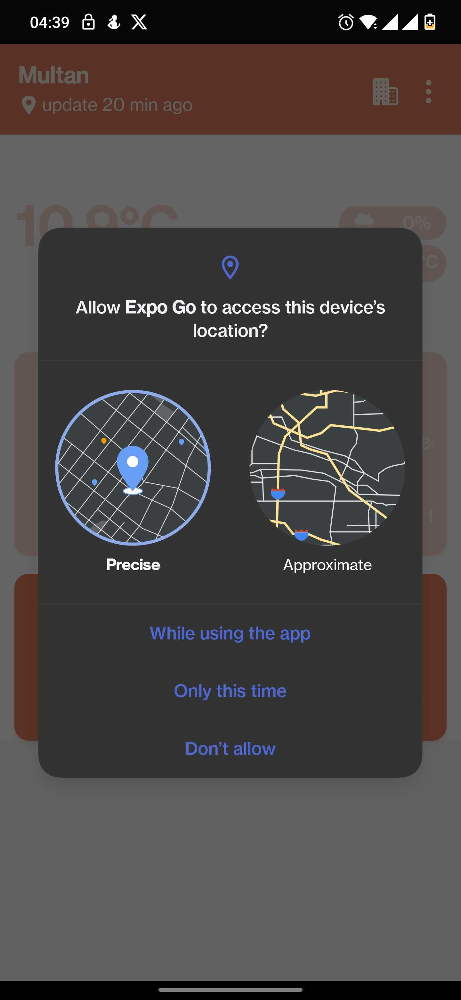
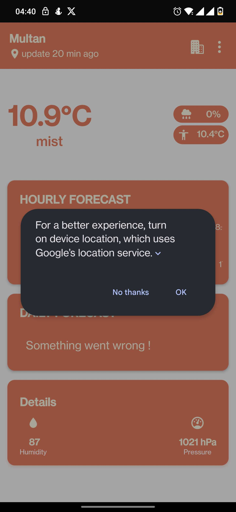
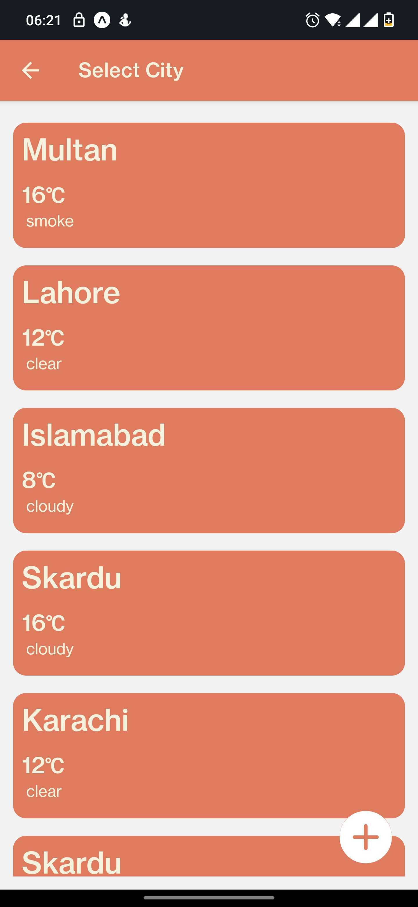
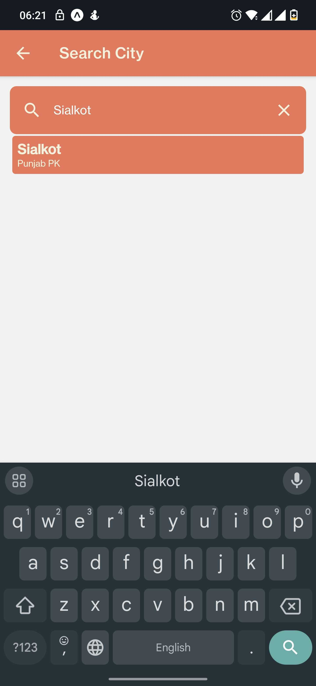
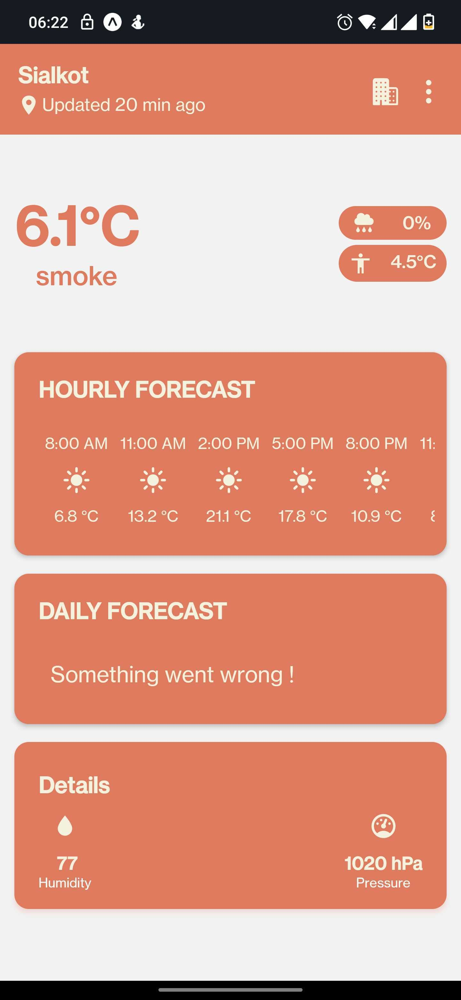

# WeatherApp - React Native

WeatherApp is a React Native application developed using Expo, designed to provide users with real-time weather updates. Leveraging the OpenWeatherMap API, it offers current weather conditions, hourly forecasts, and daily forecasts for any location around the globe.

## Features

- **Current Weather Conditions:** Get up-to-the-minute weather information.
- **Hourly Weather Forecast:** Plan your day with detailed hourly weather predictions.
- **Daily Weather Forecast:** Access a 5-day weather forecast to stay prepared.
- **City Search:** Find weather forecasts for your city or any location worldwide using the integrated search feature.

## APIs Used

- **Current, Hourly, and Daily Forecasts:** Utilizes `https://api.openweathermap.org/data/2.5` to fetch essential weather data.
- **City Search:** Employs `http://api.openweathermap.org/geo/1.0` for enabling users to search for cities in the search bar.

## Libraries Used and Why

The project utilizes several libraries, each chosen for their specific benefits:

- `@react-navigation/native` and `@react-navigation/native-stack`: For efficient navigation between the app's screens.
- `@reduxjs/toolkit: Incorporates RTK Query for efficient data fetching, caching, and reducing redundant requests to enhance performance.
- `expo` and related Expo libraries (`expo-location`, `expo-status-bar`): Provide a wide range of APIs for accessing device and system functionality, making development faster and more streamlined.
- `react` and `react-native`: The core of the app, allowing for the development of native applications using JavaScript/Typescript and React.
- `typescript`: Provides strong typing to ensure code reliability and enhance developer productivity through early error detection and rich IDE support.
- `react-native-paper`: Offers a wide range of pre-designed Material Design components for React Native, enhancing UI development.
- `react-native-safe-area-context` and `react-native-screens`: Essential for handling safe areas and screen transitions in a React Native app.

## What I would do if I had more time

Given more time, my priorities for enhancing the application would include:

- **Global State Management:** I would implement a comprehensive global state management solution to streamline state handling across the app.
  
- **TypeScript Enhancement:** I aim to refine the remaining 10-20 % TypeScript implementation, consolidating all type definitions into a single `types.ts` file. This would enhance code readability and maintainability by centralizing type definitions.

- **Exploring Additional APIs:** To provide more detailed weather forecasts, specifically daily forecast data not currently available through our primary API, I would investigate alternative weather APIs. This exploration aims to enrich the app's functionality with more comprehensive weather information.

**Improve Error Handling Message Card:** Enhancing the error handling message card to offer a better user experience. This would involve making error messages more user-friendly.

## A Screenshot/GIF of What Was Made

# Asking for location permission



# Dialog appearing for location access



# Home screen


# Select City Screen



# Search City Screen



# Selected City Results



## Getting Started

### Prerequisites

- Node.js
- Expo CLI
- A physical device or an emulator/simulator

### Running It Locally

1. **Clone the repository:**

   ```sh
   git clone https://github.com/usmangq12/weather-app.git
   cd weather-app

## Install dependencies:
```sh
npm install
expo start

## Accessing the App from the Published Link

To access the app through its published link on Expo.dev, follow these steps:

1. **Visit the Published Link:** Navigate to the published link provided in this README. The link should look something like this (replace with your actual link):

2. **Scan the QR Code or Enter manually:**

# Android Published Link to enter into Expo Go App
exp://u.expo.dev/update/2cb10a47-adde-4f20-87e0-c3562d1389aa

# IOS Published Link to enter into Expo Go App
exp://u.expo.dev/update/984508b6-4d78-4321-88e3-ee785b66f6ed

- If you are using a **physical device**, open the Expo Go app.
- Use the app to scan the QR code displayed on the page of the link above.

3. **Manual Entry:**

- Alternatively, you can manually enter the URL from the Expo.dev page directly into the Expo Go app on your device.

These steps will allow you to quickly access and test the app on your physical device without needing to run the development server locally.

## Note

Ensure you have the Expo Go app installed on your device to scan the QR code or enter the URL. This app is available on both Android and iOS platforms and is required for accessing apps published on Expo.dev.
